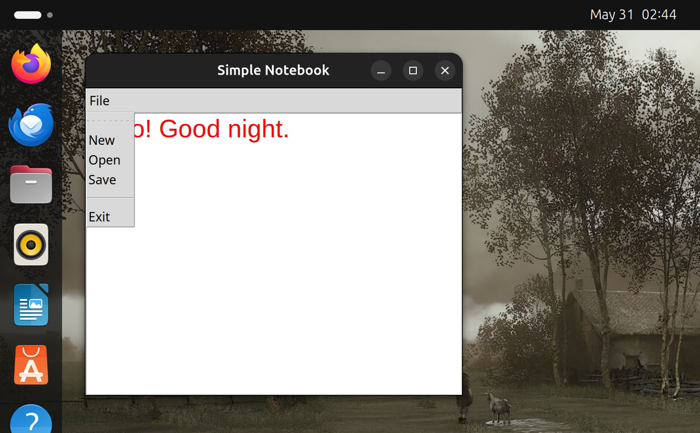

# 📝 Simple Notebook

Simple Notebook** is a basic text editor built using Python's `tkinter` library. It allows users to create, open, edit, and save plain text files with a user-friendly graphical interface.

## Deployment

To deploy this project, follow this steps
1. **Prerequisites**

   - Python 3 must be installed on your system.

   - Tkinter is included with standard Python installations. If it's missing, install it using:

      #### For Debian/Ubuntu
         sudo apt-get install python3-tk

      #### For Red Hat/Fedora
         sudo dnf install python3-tkinter

      #### For macOS (with Homebrew)
         brew install python-tk
   
2. **💻 macOS / Linux**
   - Open Terminal.

   - Clone or download this project folder.

   - Navigate to the project directory.

   - Run the following command:

         python3 notebook.py

3. **🪟 Windows**
   - Make sure Python is installed and added to your PATH.

   - Open Command Prompt or PowerShell.

   - Navigate to the project folder using cd:

         cd path\to\your\project

   - Run the following command:

         python notebook.py

    
## 🧮 How It Works

- 📄 Create new text files
- 📂 Open existing `.txt` files
- 💾 Save your work as a `.txt` file
- 🧭 Easy-to-use menu system

## Tech Stack

1. **Python** 

2. **Tkinter** : Built-in GUI library

## Output Screenshots

##### In MacOS

##### In Linux

## Author

- [@rijulmaitra](https://github.com/rijulmaitra)

