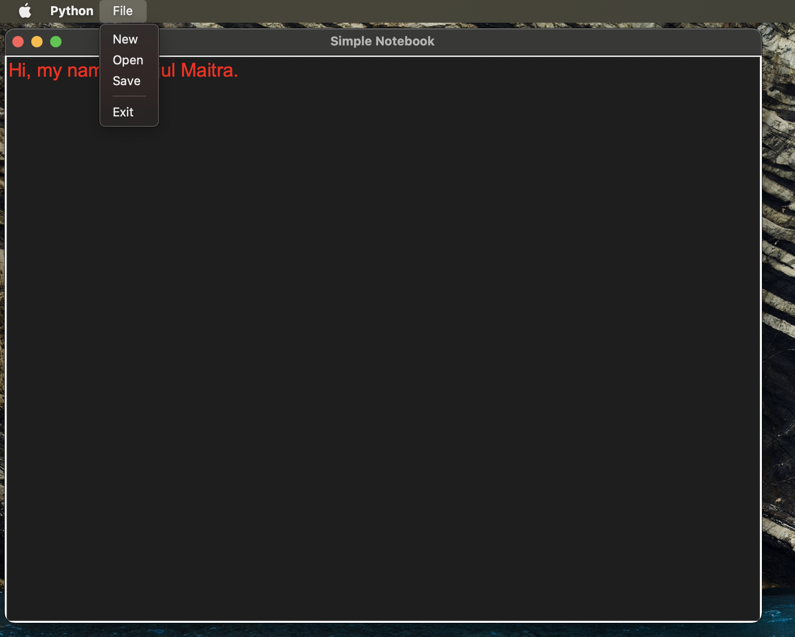

# 📝 Simple Notebook

Simple Notebook** is a basic text editor built using Python's `tkinter` library. It allows users to create, open, edit, and save plain text files with a user-friendly graphical interface.

## Deployment

To deploy this project, follow this steps

1. **Clone or download the repo.**

2. **Run this command.**

    *for Windows*
    - python notebook.py
    
    *for MacOs*
    - python3 notebook.py
## 🧮 How It Works

- 📄 Create new text files
- 📂 Open existing `.txt` files
- 💾 Save your work as a `.txt` file
- 🧭 Easy-to-use menu system

## Tech Stack

1. **Python** 

2. **Tkinter** - Built-in GUI library

## Screenshots

<!--  -->
<!--  -->

## Author

- [@rijulmaitra](https://github.com/rijulmaitra)

